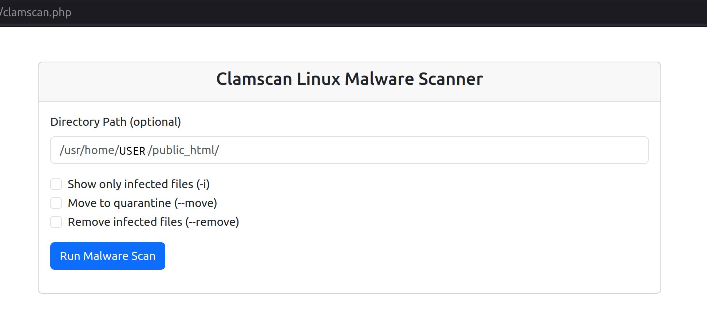

# Clamscan Linux Malware Scanner


A simple php based web application to run `clamscan` on a Linux system,
allowing users to perform malware scans with customizable options. This
application uses PHP and Bootstrap 5 for the frontend and provides options to
move infected files to a quarantine directory or remove them.

## Features

- **Directory Path**: Optionally specify a directory to scan. Defaults to site's base directory.
- **Scan Options**: Choose from the following options:
  - **Show Only Infected (`-i`)**: Display only infected files.
  - **Move to Quarantine (`--move`)**: Move infected files to a `.quarantine` directory.
  - **Remove Infected Files (`--remove`)**: Delete infected files.
- **Progress Indicator**: Shows a spinner while a scan is in progress.



## Requirements

- PHP 7.4 or later
- ClamAV (`clamscan`)
- Web server with PHP support (e.g., Apache, Nginx)

## Installation

1. **Clone** the project to your server:
```bash
git clone https://github.com/BlueSquare23/php-clamscan.git
cd php-clamscan
```

2. **Install Dependencies**: Ensure PHP and ClamAV are installed on your system.

3. **Set Up Web Server**: Place the project files in your web site's document root.
```bash
cp eicar.txt check_scan.php clamscan.php start_scan.php /path/to/your/sitefiles/
```

4. **Permissions**: Ensure the web server user has write permissions to the directory where `clamscan` output and PID files will be stored.

5. **Access the Application**: Open your web browser and navigate to the application.
 * Example:
```
http://yourdomain.com/clamscan.php
```

6. **Testing the Application**: You can test everything is working properly by running a scan. If it reports the included `eicar.txt` file then you know everything is working properly.

## Usage

1. **Select Directory Path**: Optionally specify the directory you want to scan.

2. **Choose Scan Options**: Select the desired options:
   - **Show Only Infected**: To list only infected files.
   - **Move to Quarantine**: To move infected files to a `.quarantine` directory.
   - **Remove**: To delete infected files.

3. **Run Scan**: Click the "Run Malware Scan" button to start the scan.

4. **Monitor Progress**: A spinner will show while the scan is in progress. Scan results will be printed when completed. For right now, do not leave / refresh the page.

## Troubleshooting

- **ClamAV Not Found**: Ensure ClamAV is installed and properly configured. You can check this by running `which clamscan` in your terminal.
- **Permissions Issues**: Verify that the web server user has appropriate permissions to create and write to the `.quarantine` directory and other necessary files.

## License

This project is licensed under the MIT License. See the [LICENSE.txt](LICENSE.txt) file for details.

## Contact

For any issues or questions, please open an issue on the [GitHub repository](https://github.com/BlueSquare23/php-clamscan/issues).

